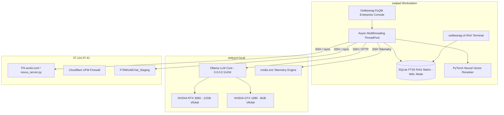

# 🦉 OWLBEARAG — Enterprise Multi-Node Hybrid RAG & GPU Compute Console

[](https://github.com/areqpl/Owlbearag)
[](https://opensource.org/licenses/MIT)
[](https://www.python.org/downloads/)
[](https://pytorch.org/)
[](https://pypi.org/project/PyQt6/)

**Owlbearag** is an enterprise-grade, high-availability multi-node AI control suite, PyTorch neural vector reranker, and Cloudflare VPS synchronization console. Designed for local workstation deployment, dual-GPU server orchestration (`NVIDIA RTX 3060 + GTX 1080`), and remote Cloudflare production VPS clusters.

---

## 🌟 Key Enterprise Features

- **⚡ Async Multithreading Workers & Action Confirmation**: All network requests, model inferences, and remote node commands run in dedicated background `QThread` workers. Major mutating actions (model removal, service restart, matrix rebuilding) require explicit user confirmation dialogs before execution.
- **⚡ Dual-GPU Telemetry & Model Management**: Real-time `nvidia-smi` telemetry (VRAM memory allocation, GPU temperatures, core utilization) and remote Ollama model deployment (`pull` / `rm`) over SSH.
- **🔥 PyTorch Neural Vector Reranker**: Custom PyTorch CUDA-accelerated float16 cosine similarity matrix calculation for high-precision document chunk reranking.
- **🌐 Cloudflare F76 VPS Synchronization**: Automated `rsync` background workers for pulling production project configurations and staging deployments from remote Cloudflare VPS servers.
- **🔧 Automated Self-Healing Ollama Resolver**: 3-stage automated connection resolver that detects HTTP endpoint failures, probes local fallbacks, and executes remote systemd service restarts.
- **📂 Granular RAG Matrix Indexer**: Multi-threaded indexing engine with file-by-file progress tracking for skills, prompts, chat transcripts, and system documents into SQLite FTS5 (WAL Mode).
- **🖥️ Dual Interface Options**: Ultra-sleek **PyQt6 Enterprise Desktop GUI** and colorful **Rich Terminal CLI (`owlbearag-cli`)**.
- **🔐 Secure Credential Management**: Mode `0600` owner-only encrypted configuration storage (`~/.gemini/antigravity-cli/config.json`).

---

## 🏗️ System Architecture



---

## 🚀 Quick Start

### 1. Installation

Clone the repository and install in editable mode:

```bash
git clone https://github.com/areqpl/Owlbearag.git
cd Owlbearag
pip install -e .
```

### 2. Launch Desktop GUI

```bash
owlbearag
```

### 3. Launch Rich Terminal CLI

```bash
# Query Dual GPU Telemetry
owlbearag-cli gpu status

# Query RAG Knowledge Matrix
owlbearag-cli rag "PyTorch"

# Check Cloudflare VPS Status
owlbearag-cli vps status
```

---

## 🔐 Security & Configuration

All endpoints, SSH keys, and configuration options are saved securely at `~/.gemini/antigravity-cli/config.json` with owner-only `0600` permissions.

Example `config.json`:

```json
{
  "ollama_host": "http://owlyyyrt.local:11434",
  "remote_gpu_host": "owlyyy@owlyyyrt.local",
  "remote_vps_host": "owlyyy@37.114.37.41",
  "use_pytorch_reranker": true,
  "pytorch_device": "cuda"
}
```

---

## 📜 License

This project is released under the **MIT License**.
